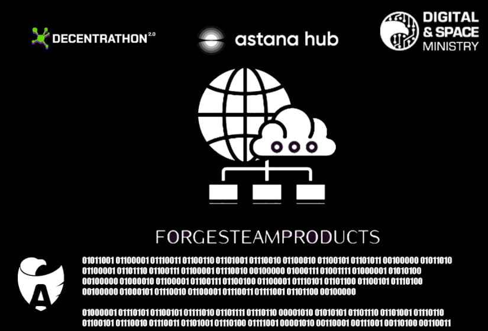

# ForgesTeamProducts Bot



## Описание

Этот бот предназначен для предоставления медицинских консультаций с использованием модели Google Gemini AI. Пользователи могут зарегистрироваться, предоставить свои данные и задавать вопросы, на которые бот будет генерировать ответы на основе введенной информации.

### Основные функции:

- Регистрация пользователей с сохранением их данных (имя, вес, рост, год рождения).
- Генерация ответов на основе предоставленных пользователем данных и вопросов.
- Многоязычная поддержка (Русский, English, Казахский).

## Установка

1. Клонируйте репозиторий:
   ```bash
   git clone https://github.com/OctaviansSon/AiShymDecentrathon
   cd AiShymDecentrathon
### 2.Установите зависимости:
pip install -r req.txt
Настройте базу данных и выполните необходимые миграции.
Запустите бота:
python bot4.py


### 3.Лицензия
Этот проект лицензирован под MIT License - см. файл LICENSE для подробностей. 
Файл LICENSE.txt
Ваш файл `LICENSE.txt` тоже в порядке. Убедитесь, что вы указали правильный год и имя (как вы уже сделали):

MIT License

Copyright (c) 2024 Yasfirbek

Разрешается бесплатное использование, копирование, изменение, слияние, публикация, распространение, передача, продажа копий данного ПО, а также право на разрешение лицам, которым предоставляется данное ПО, делать это, при соблюдении следующих условий:

Указание на авторство. Везде, где упоминается данное ПО, необходимо указывать оригинального автора или авторов.
Отказ от гарантии. Данное ПО предоставляется "как есть", без каких-либо гарантий, явных или подразумеваемых, включая, но не ограничиваясь, подразумеваемыми гарантиями товарного состояния, пригодности для конкретной цели и ненарушения прав. Ни при каких обстоятельствах автор или правообладатель не несёт ответственности за какие-либо претензии, убытки или иные обязательства, будь то в результате иска, контракта или иного, возникающие из, в связи с или в связи с использованием данного ПО или иными действиями с ним.


### 4. Проверка
После внесения изменений, убедитесь, что ваш `README.md` и `LICENSE.txt` загружены правильно на GitHub, и все ссылки работают. Если у вас есть другие вопросы или нужно внести еще какие-либо изменения, дайте знать!
